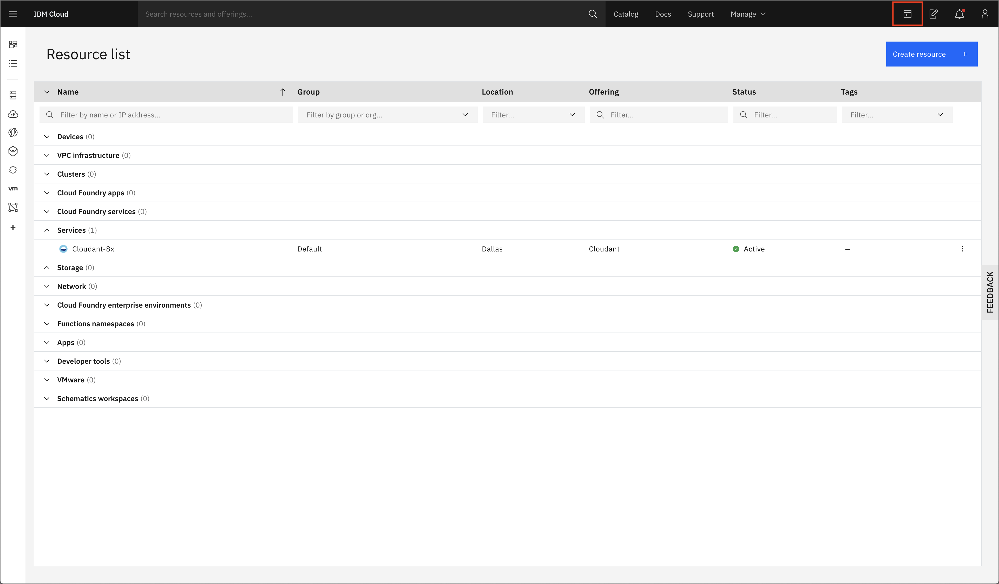
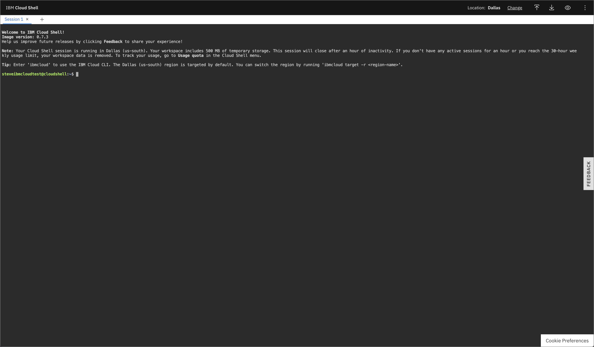

# Instructions for deploying a [Battlesnake](http://play.battlesnake.com) on IBM Cloud

> Credit goes to the [Node.js Starter Battlesnake](https://github.com/BattlesnakeOfficial/starter-snake-node) for instructions on how to register your battlesnake. And to [Colin Walker](https://github.com/colinjfw) for his tutorial <https://colinjfw.github.io/battlesnake-learn/> that extended the starter BattleSnake.

This repo contains instructions on how to deploy your Battlesnake to IBM Cloud.

## Prerequisites

* [Battlesnake Account](https://play.battlesnake.com)
* [IBM Cloud Account](http://cloud.ibm.com/registration)
* [GitHub Account](https://github.com) (Optional)

## Running Your Battlesnake on [IBM Cloud](http://cloud.ibm.com)

1. Login to your [IBM Cloud](http://cloud.ibm.com/) account.

2. Launch the _IBM Cloud Shell_, which is available by clicking on the terminal icon on the top right.

   

3. Once loaded, you'll be presented with an embedded web terminal that has the `ibmcloud` CLI and other tools available.

   

4. Clone this repo so we have the source code we want to deploy. Copy the following command into the terminal

   ```bash
   git clone https://github.com/IBM/starter-snake-node
   ```

   and navigate into the directory of the cloned repository

   ```bash
   cd starter-snake-node
   ```

5. To deploy the application with Cloud Foundry we first we need to target a Cloud Foundry API endpoint. To do this, run the following interactive command.

   ```bash
   ibmcloud target --cf
   ```

   You should see output like the example below:

   ```bash
   $ ibmcloud target --cf
   Targeted Cloud Foundry (https://api.us-south.cf.cloud.ibm.com)

   Targeted org stevemar@ibm.com

   Targeted space dev

   API endpoint:      https://cloud.ibm.com
   Region:            us-south
   User:              stevemar@ibm.com
   Account:           Steve Martinelli Account
   Resource group:    default
   CF API endpoint:   https://api.us-south.cf.cloud.ibm.com (API version: 2.152.0)
   Org:               stevemar@ibm.com
   Space:             dev
   ```

6. We can now deploy our application with `cf push`.

   ```bash
   ibmcloud cf push
   ```

   You should see output like the example below:

   ```bash
   $ ibmcloud cf push
   Invoking 'cf push'...

   Using manifest file /home/stevemar/node-hello-world/manifest.yml
   ...
   Creating app starter-snake-node...
   ...
   name:              starter-snake-node
   requested state:   started
   routes:            starter-snake-node-surprised-kudu-ec.mybluemix.net
   last uploaded:     Mon 14 Sep 13:46:54 UTC 2020
   stack:             cflinuxfs3
   buildpacks:        sdk-for-nodejs
   type:            web
   instances:       1/1
   memory usage:    64M
   ```

7. To access the application navigate to the URL that is show in the `routes` value, in the example above it is:

   ```ini
   https://starter-snake-node-surprised-kudu-ec.mybluemix.net
   ```

   If all goes well - you should see text similar to this:

   ```json
   {"apiversion":"1","author":"stevemar","color":"#00ff00","head":"default","tail":"default"}
   ```

   This means your Battlesnake is running correctly on IBM Cloud.

**At this point your Battlesnake is live and ready to enter games!**

## Registering Your Battlesnake and Creating Your First Game

1. Sign in to [play.battlesnake.com](https://play.battlesnake.com/login/).

2. Go [here to create a new Battlesnake](https://play.battlesnake.com/account/snakes/create/). Give it a meaningful name and complete the form using the URL for your Repl from above.

3. Once your Battlesnake has been saved you can [create a new game](https://play.battlesnake.com/account/games/create/) and add your Battlesnake to it. Type your Battlesnake's name into the search field and click "Add" to add it to the game. Then click "Create Game" to start the game.

4. You should see a brand new Battlesnake game with your Battlesnake in it! Yay! Press "Play" to start the game and watch how your Battlesnake behaves.

5. Feel free to fork this repo and repeat the steps from the above section to point to your own repository instead of this one.

**At this point you should have a registered Battlesnake and be able to create games!**

For more information check out the [Node.js Starter Battlesnake](https://github.com/BattlesnakeOfficial/starter-snake-node).
